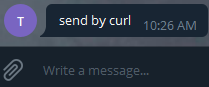
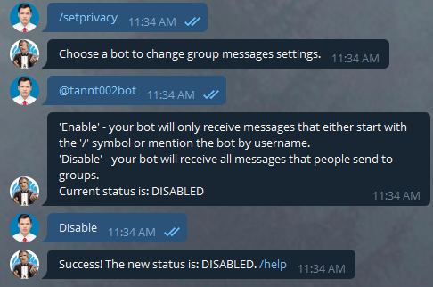
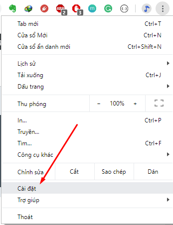
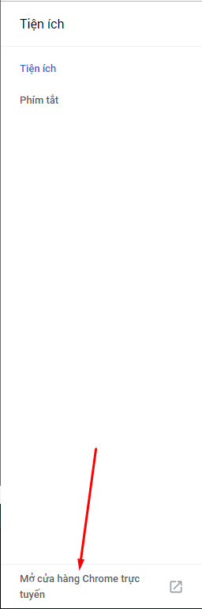
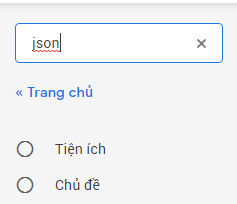
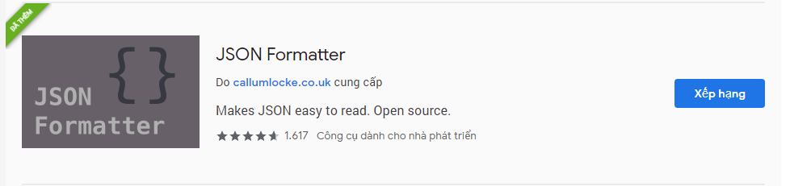
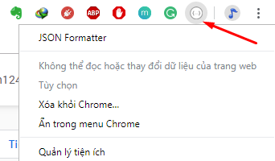
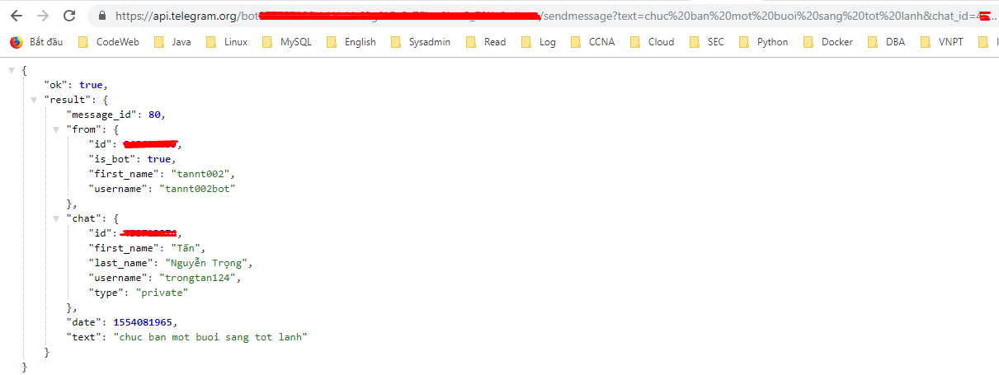

## Khởi tạo

Để làm việc với telegram bot, việc đầu tiên là tạo ra một con bot thông qua `BotFather` của telegram. 

Việc cài đặt ứng dụng telegram tôi ko hướng dẫn ở đây, bạn có thể tìm thông qua [google.com](google.com)

Trong ứng dụng telegram, ta gõ từ `botfather` để tìm thông tin:


Lựa chọn `botfather` để tương tác, bắt đầu quá trình tạo ra bot mới.


Chạy lệnh `/newbot` để tạo bot, bạn điền `Name` cho bot. Đây là tên mà sẽ hiển thị khi tương tác. Tôi đặt `Name` cho bot của tôi là `tannt002`


Sau đó, `botfather` sẽ yêu cầu bạn đặt tiếp một `username`. Yêu cầu của `username` là phải kết thúc mà có từ `bot`:


`Name` và `username` khác nhau như thế nào? một cái là tên hiển thị, một cái là tên dùng trong việc tìm kiếm ở ứng dụng telegram.

Sẽ có một token được tạo ra để tương tác với API của bot. Bạn nên giữ cẩn thận token này, vì nếu bị lộ ra thì người khác cũng sẽ
 điều khiển được bot của bạn (mình có thử nhưng cùng 1 thời điểm chỉ 1 kết nối vào API của bot này).
 
## Sử dụng

OK, bạn đã tạo ra được một bot của riêng mình. Giờ chúng ta sẽ kiểm tra xem bot này hoạt động như thế nào.

Đầu tiên, bạn cần gửi tới bot một một message thì bot mới có thể tương tác với bạn được.

Bạn tìm kiếm bot bằng `username` của bot


sau khi nhắn cho bot một message bất kỳ, bạn sử dụng API sau để lấy thông tin về message mà bot nhận được

```sh
https://api.telegram.org/bot<TOKEN_BOT>/getupdates
```

Kết quả


Tôi phải ẩn thông tin về token và CHAT_ID của tôi, vì lý do an toàn. Tại sao vậy, vì với token thì bạn có thể điều khiên bot của tôi, 
còn với CHAT_ID thì bạn có thể spam tin hoặc làm gì đó mà tôi ko thích. :D

Rồi, bây giờ bạn đã dùng CHAT_ID của message vừa nhận được, sử dụng API sau để yêu cầu bot gửi một message cho tôi.

```sh
https://api.telegram.org/bot<TOKEN_BOT>/sendMessage?chat_id=<CHAT_ID>&text=anhdeptraiquatroi
```

Kết quả khi gọi API trên:


Kiểm tra ở cửa sổ chat với bot sẽ có tin nhắn tương tác


## Bổ sung

Cách kiểm tra API như trên là cách "thô thiển" nhất, thường chỉ dành cho dân amater như tôi. =))

Thông thường, bạn sẽ sử dụng các ngôn ngữ lập trình khác nhau để viết ra các lời gọi API theo kịch bản mong muốn. Ví dụ như:

- Xử lý dữ liệu rồi gọi API gửi báo cáo
- Tạo chatbot rồi tương tác với người dùng.
- ....

Trên máy chủ Ubuntu, bạn có thể sử dụng lệnh curl để gửi message.

```sh
curl -X POST "https://api.telegram.org/bot<TOKEN_BOT>/sendMessage" -d "chat_id=<CHAT_ID>&text=send by curl"
```

Kết quả của lệnh trên:



Thêm một chút về bot, mặc định khi tạo ra telegram bot, nó chưa được thiết lập quyền để trao đổi trong các group, nên bạn có add bot vào trong một group thì nó 
cũng không thể tương tác với group đó, bạn phải thiết lập policy để cho phép bot tương tác với group. Trong `BotFather` chúng ta chạy lệnh `/setprivacy`



Nếu bạn có nhiều bot thì chọn bot muốn cấu hình.

### Bổ sung plugin cho trình duyệt.

Việc test API của telegram bot như trên, nhìn kết quả khá lởm. Tôi thử cài bổ sung plugin cho trình duyệt thì nhìn ngon hơn hẳn. Cái này chắc ai code nhiều sẽ biết, mình tay ngang đi qua nên tự vọc và phát hiện ra.

Ở trình duyệt chrome, bạn vào phần tiện ích.



Tiếp tục chọn vào tiện ích


Trong tiện ích, lại tiếp tục chọn phần mở cửa hàng



Gõ vào ô tìm kiếm từ `json`



Sau đó, lựa chọn `JSON formatter` và thêm vào trình duyệt. Do tôi đã thêm vào từ trước rồi



Xong rồi, bây giờ trên thanh điều khiển của trình duyệt chrome bạn sẽ thấy biểu tượng của addon vừa thêm vào



Kiểm tra kết quả hiển thị khi gọi API xem đã ngon lành chưa?



OK, trong bài sau, chúng ta sẽ sử dụng các ngôn ngữ lập trình khác nhau để tạo ra một telegram bot ngon lành và xịn hơn.

## Tham khảo

- [https://github.com/hocchudong/ghichep-telegram-bot/blob/master/docs/tele_bot_intro.md](https://github.com/hocchudong/ghichep-telegram-bot/blob/master/docs/tele_bot_intro.md)