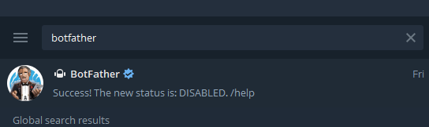
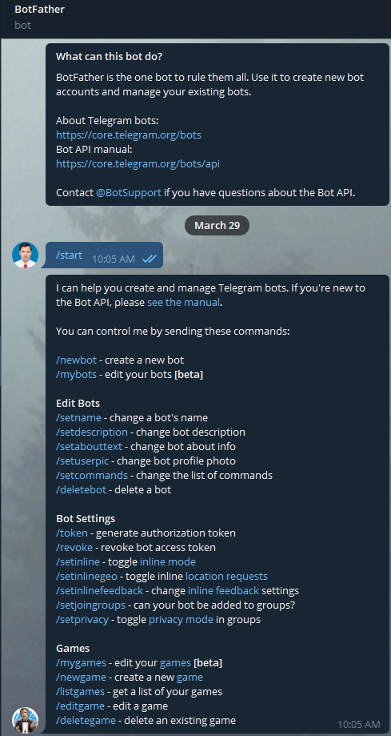
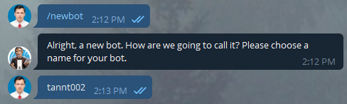
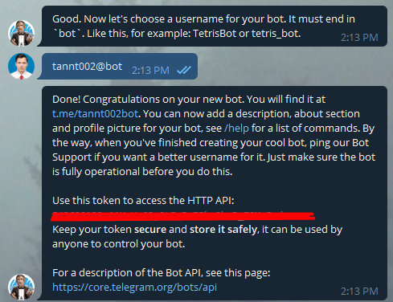
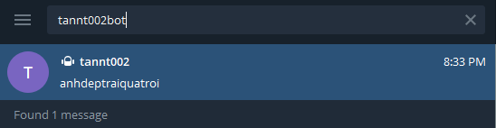
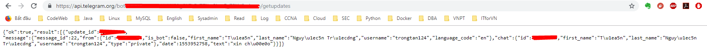
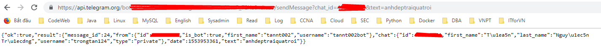
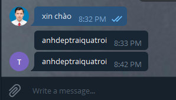

## Khởi tạo

Để làm việc với telegram bot, việc đầu tiên là tạo ra một con bot thông qua `BotFather` của telegram. 

Việc cài đặt ứng dụng telegram tôi ko hướng dẫn ở đây, bạn có thể tìm thông qua [google.com](google.com)

Trong ứng dụng telegram, ta gõ từ `botfather` để tìm thông tin:



Lựa chọn `botfather` để tương tác, bắt đầu quá trình tạo ra bot mới.



Chạy lệnh `/newbot` để tạo bot, bạn điền `Name` cho bot. Đây là tên mà sẽ hiển thị khi tương tác. Tôi đặt `Name` cho bot của tôi là `tannt002`



Sau đó, `botfather` sẽ yêu cầu bạn đặt tiếp một `username`. Yêu cầu của `username` là phải kết thúc mà có từ `bot`:



`Name` và `username` khác nhau như thế nào? một cái là tên hiển thị, một cái là tên dùng trong việc tìm kiếm ở ứng dụng telegram.

Sẽ có một token được tạo ra để tương tác với API của bot. Bạn nên giữ cẩn thận token này, vì nếu bị lộ ra thì người khác cũng sẽ
 điều khiển được bot của bạn (mình có thử nhưng cùng 1 thời điểm chỉ 1 kết nối vào API của bot này).
 
## Sử dụng

OK, bạn đã tạo ra được một bot của riêng mình. Giờ chúng ta sẽ kiểm tra xem bot này hoạt động như thế nào.

Đầu tiên, bạn cần gửi tới bot một một message thì bot mới có thể tương tác với bạn được.

Bạn tìm kiếm bot bằng `username` của bot



sau khi nhắn cho bot một message bất kỳ, bạn sử dụng API sau để lấy thông tin về message mà bot nhận được

```sh
https://api.telegram.org/bot<ID_BOT>/getupdates
```

Kết quả



Tôi phải ẩn thông tin về token và CHAT_ID của tôi, vì lý do an toàn. Tại sao vậy, vì với token thì bạn có thể điều khiên bot của tôi, 
còn với CHAT_ID thì bạn có thể spam tin hoặc làm gì đó mà tôi ko thích. :D

Rồi, bây giờ bạn đã dùng CHAT_ID của message vừa nhận được, sử dụng API sau để yêu cầu bot gửi một message cho tôi.

```sh
https://api.telegram.org/bot<ID_BOT>/sendMessage?chat_id=<CHAT_ID>&text=anhdeptraiquatroi
```

Kết quả khi gọi API trên:



Kiểm tra ở cửa sổ chat với bot sẽ có tin nhắn tương tác



## Tham khảo

- [https://github.com/hocchudong/ghichep-telegram-bot/blob/master/docs/tele_bot_intro.md](https://github.com/hocchudong/ghichep-telegram-bot/blob/master/docs/tele_bot_intro.md)