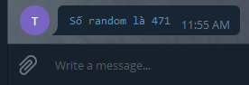

## Chuẩn bị

Tôi sử dụng python để lập trình cho bot. Nếu bạn chưa biết về python thì có thể học nó, khá dễ học. Tôi cũng ko phải 
là dân lập trình, nhưng thích lập trình nên tự học python thôi. Tôi code khá amater, nhưng tự vọc vạch chút coi như 
niềm vui. :)

Tôi sử dụng nền tảng Linux là: Ubuntu và CentOS để chạy chương trình.

Đầu tiên, chúng ta cần phải cài đặt thư viện python để sử dụng. Nói chung, bạn thích tự viết các function để bind tới API cũng dc thôi, nhưng khi người ta đã tạo ra 
cái bánh xe rồi thì đừng mất công thiết kế lại nữa. :D.

Tôi thấy có 02 thư viện python là `python-telegram-bot` và `telepot`, có thể có cái khác nữa mà tôi không biết. Để sau đi, giờ xài 02 thư viện này đã.

## Sử dụng thư viện python-telegram-bot

Trên máy chủ Ubuntu, chúng ta cần chạy lệnh để cài `python-telegram-bot`. Cần chú ý là thư viện này chỉ làm việc với python3. 

Trên máy chủ Ubuntu thường có sẵn python2.7 và python3.4

```sh
root@compute1:~# python
python             python2.7          python3.4          python3.4m         python3-config     python3m-config    
python2            python3            python3.4-config   python3.4m-config  python3m        
```

Khi cài đặt thư viện `python-telegram-bot` sẽ cài đặt một có gói phụ thuộc, để tránh ảnh hưởng tới cái gói đã được cài đặt trên máy chủ từ trước, chúng ta tạo ra một 
virtual environment. Bạn có thể hiểu, khi tạo ra một virtual environment tức là chúng ta tạo ra một bản copy các tập tin cần thiết để chạy python. Khi ở trong `env` này, mọi 
gói được cài đặt thêm đều chỉ gói gọn trong `env` đó.

Cài virtualenv trước bằng lệnh sau, và kiểm tra xem python3 đang đặt ở thư mục nào:

```sh
pip3 install virtualenv

which python3
```

Sau đó, tạo ra một env với python3 và cài đặt thư viện:

```sh
virtualenv -p /usr/bin/python3 envtelegrambot
source envtelegrambot/bin/activate
pip install python-telegram-bot
```

## Viết chương trình

OK, giờ bạn đã có môi trường để bắt đầu thực hành rồi.

Lúc này chúng ta vẫn đang ở trong `env` là envtelegrambot, chúng ta tạo ra một script bằng lệnh `vim script.py` với nội dung đơn giản như sau:

```sh
import telegram
import random

def send_test_message():
    try:
        random_number = random.randint(0, 1000)
        telegram_notify = telegram.Bot("TOKEN")
        message = "`Số random là {}`".format(random_number) 
    
        telegram_notify.send_message(chat_id="CHAT_ID", text=message,
                                parse_mode='Markdown')
    except Exception as ex:
        print(ex)

send_test_message()
```

Nếu bạn chưa có trình soạn thảo `vim` thì có thể cài bằng lệnh sau, hoặc xài `nano`, `atom

Giải thích chút về script trên. 

Đầu tiên, bạn phải thay 2 trường `TOKEN` và `CHAT_ID` tương ứng với token của bot và ID của người nhận message vào script.

Trong script, sẽ import thư viện cần thiết để giao tiếp với API của bot là `telegram`, thư viện này được cài vào máy khi bạn cài `python-telegram-bot`

Một số hàm được sử dụng như: `telegram.Bot`, `send_message`

Script sẽ gửi một tin nhắn với nội dung là: `Số random là xxx` tới người nhận.

Chạy lệnh sau để script thực thi

```sh
(envtelegrambot) root@compute1:~# python script.py
```

Lúc này bạn gọi lệnh python, nó cũng ánh xạ tới python3 thì phải. cái này chưa sure lắm, vì vẫn đang tìm hiểu. :D.

Kết quả như sau:



Cơ bản chúng ta cũng đã có một script làm việc được với API của bot. 

Phần sau, chúng ta sẽ làm một chương trình to hơn tý. 

## Tham khảo

- [https://blog.cloud365.vn/linux/tao-canh-bao-su-dung-telegram-python/](https://blog.cloud365.vn/linux/tao-canh-bao-su-dung-telegram-python/)